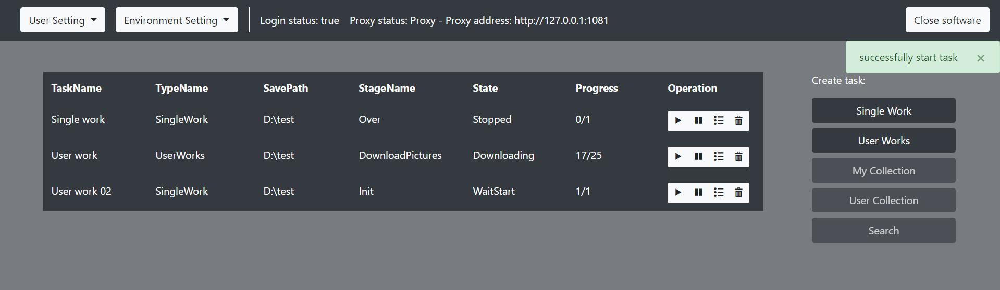

## 这是什么？

&emsp;&emsp;`PixivOC` 是一个 `Pixiv` 爬虫服务器。你可以将服务器部署在本地电脑上或者远程服务器上，然后使用网页来进行控制。

## 特点

- 境内无需翻墙即可访问：在境内是无法直接访问 `Pixiv` 的，应用通过更改访问网站域名为访问 IP 地址的方式，实现了境内无需代理即可访问。
- 高性能异步下载图片：下载图片时采用了 `aiohttp` 库进行异步下载，用户可以通过简单的调节参数来最大化下载速度。
- 远程操作：`PixivOC` 采用 `Http` 请求进行服务器的控制，这意味着你将服务器部署在任意地方，然后通过网页来远程访问控制服务器。
- 自定义客户端：服务器通过 `Http` 请求进行控制，你可以根据自己的需求按照文档编写出自己的客户端。

## 依赖库

- requests
- aiohttp
- flask

## 使用说明

[链接](https://github.com/asnml/PixivOC/blob/master/docs/%E4%BD%BF%E7%94%A8%E8%AF%B4%E6%98%8E.md)