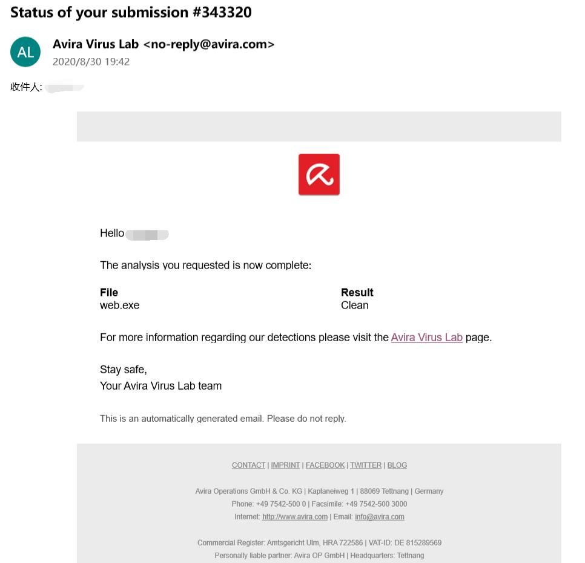

## 使用教程

### 1 安装

解压压缩包后双击 `web.exe` 即可运行。若运行 `exe` 时杀软提示含有病毒，请查看[这里](#关于软件报毒)。

### 2 初始化

使用程序前首先需要进行安全设置。使用记事本或者其他的编辑器打开根目录下的 `Options.json` 文件，其将会显示以下内容

```json
{"ServerPort": 13575, "SecretKey": "Any string, the more complex the better", "ConsolePassword": "Hello world"}
```

`ServerPort` 是应用程序将要使用的端口，更改此项对应的数值可更改应用程序使用的端口。

`SecretKey` 为用于加密 `session` 时使用的密钥，用户应更改此项的值。值可以是任意的字符串，其组成越复杂越好。

`ConsolePassword` 为控制台密码，在登陆控制台时，需输入改密码，用户应更改此项的值。

>注意：更改后的内容必须符合 json 格式标准，否则应用程序将会出错。可用此[链接](https://www.bejson.com/)检查更改后的文件是否符合标准。

>注意：因为 HTTP 协议为明文传输协议，故上述选项只能在一定程度上保护数据安全。若将应用部署在服务器上，且需要确保传输安全的话，请使用 HTTPS 协议。

### 3 启动

打开浏览器输入 `http://127.0.0.1:13575/static/index.html` 即可进入内置的控制台网页，其中 13575 为默认的端口。若应用部署在服务器上，则访问地址为 `http://ServerIpAddress:Port/static/index.html` 。

### 4 内置控制台网页使用

控制台页面由用户设置、环境设置、状态栏、表格、创建任务按钮组、关闭按钮六个部分组成。

**用户设置**：`User Setting` 按钮组显示在页面左上角，该按钮组内含 `Login` ，`Logout` 两个按钮，用于登陆以及登出用户。应用必须在用户登陆后才有权限访问 `Pixiv` 的 `API` ，换而言之就是用户必须登陆后才能进行创建任务和启动任务的操作。

- Login：当点击 `Login` 按钮后，将会弹出一个窗口，用户在窗口内输入用户名和密码后，点击 `Submit` 即可将数据传递给应用进行登陆操作。当登陆成功时，右侧状态栏的 `Login status` 将会显示为 `true` 。PS：因为控制台每隔一分钟才会进行一次环境设置更新，所以在进行登陆操作后约5~10秒后，用户可手动刷新页面查看登陆是否成功。若长时间未显示登陆成功，请检查用户名和密码是否错误以及代理是否连通。

- Logout：该功能暂未实现，若需登出，请手动删除程序根目录下的 `Token.json` 文件。

**环境设置**：`User Setting` 按钮组用于设置应用的运行参数，其包含以下选项

- Proxy：通过该选项可设置应用程序是否使用代理，其拥有三个选项可选择 Direct、Proxy、IP 。`Direct` 选项表示不使用代理，直接进行网络连接。`Proxy` 选项表示使用用户输入的 `HTTP` 地址作为代理进行网络连接。`IP` 选项表示不使用代理直接，但使用域名转换功能直接进行网络连接，使用该选项后，国内用户可无需使用 `VPN` 便直接访问，以及下载图片。
- Timeout：下载图片时每一个请求的超时时间，默认60。若下载缓慢，查看日志发现反复进行重连操作时，可适当增大该值。
- Async concurrent number：设置每次进行下载时，并发的图片下载请求数，默认3。通过增大该值，可提高图片下载速度，但同时也更容易触发重连操作，建议在下载时网速未达到满值时启用。
- Sync request interval：访问 `Pixiv` 接口的频率，默认3。不建议更改此项的值。

**创建任务按钮组**：通过点击该按钮组内的按钮，可创建相应的任务。

- Single Work：下载单个 `PixivID` 作品，其创建参数为：
  - Task Name：任务名，任务名可以随意填写，但必须符合 `Windows` 文件名创建规则。
  - Key Word：作品 `ID` 。
  - Save Path：保存路径。注意，保存路径是相对于启动软件的宿主机而言的。
- User Works：下载某个作者的全部作品，其创建参数为：
  - Task Name：任务名，任务名可以随意填写，但必须符合 `Windows` 文件名创建规则。
  - Key Word：作者的 `PixivID` 。
  - Save Path：保存路径。注意，保存路径是相对于启动软件的宿主机而言的。

**关闭按钮**：点击该按钮即可关闭软件。**注意，请勿手动点击软件窗口的关闭按钮直接关闭软件！**直接点击软件窗口的关闭按钮的话，将会丢失未保存的任务数据。

## 关于软件报毒

使用 `PyInstaller` 打包后的 `exe` 启动时会被杀软误报已经是一个[长期问题](https://stackoverflow.com/questions/55907339/exe-created-by-pyinstaller-gets-deleted-by-antivirus)了，若发现软件报毒，请将 `exe` 或者压缩包提供给杀软实验室进行检测，并注明为假阳性（Suspected False Positive）。以下为 Avira 提供的[检测结果](https://github.com/asnml/PixivOC/blob/master/docs/Detect.jpg)。

